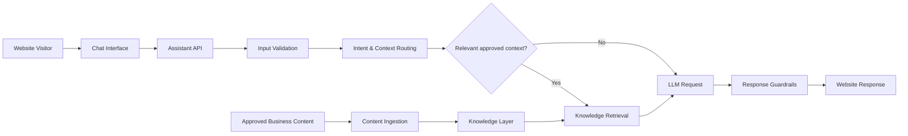

# Mauro Benigno AI Chatbot — Portfolio Showcase

> **Portfolio showcase only.** This repository documents the architecture and engineering patterns of a real AI assistant implemented for MauroBenigno.com. It intentionally does **not** contain production credentials, prompts, private knowledge-base content, infrastructure addresses, webhook URLs, API keys, model configuration, analytics data, or deployable production code.

## Project goal

The assistant was designed to turn a consulting website from a static information source into an interactive business-support channel.

Instead of behaving like a generic FAQ bot, the assistant is structured to:

- understand visitor questions;
- use approved business context when relevant;
- answer consistently with the consultant's services and positioning;
- guide users toward relevant services or next actions;
- avoid inventing information when context is insufficient;
- keep the AI service separated from the website presentation layer.

## Capabilities demonstrated

- AI chatbot / website assistant architecture
- LLM API integration
- Knowledge-guided response generation
- Retrieval-oriented context handling
- REST API service design
- FastAPI / asynchronous backend patterns
- Prompt and policy separation
- Input validation and sanitisation
- Controlled fallback behaviour
- Multilingual-ready interaction design
- Lead-oriented conversational routing
- Health monitoring and service isolation
- Website-to-AI backend integration

## High-level architecture

The diagram intentionally shows the architectural pattern rather than the production implementation.

## Business value

A consulting website often receives visitors who do not yet know which service fits their situation. A controlled AI assistant can reduce this friction by interpreting the request, explaining relevant capabilities and helping the visitor reach the right next step.

The core design challenge is not simply connecting a website to an LLM. It is controlling:

1. what context the assistant may use;
2. how confidently it may answer;
3. what happens when information is missing;
4. how the website and AI backend remain independently maintainable;
5. how conversations support business development without turning into uncontrolled automated advice.

## My role

**AI Automation Consultant & Solution Designer**

I designed the assistant architecture, backend interaction flow, knowledge-guided response model, validation boundaries and website integration logic.

## Technologies and patterns

The production solution uses a lightweight API service and external LLM capabilities. The public showcase intentionally abstracts provider-specific configuration.

Representative technologies and patterns include:

- Python
- FastAPI
- Uvicorn / ASGI
- REST APIs
- LLM integration
- retrieval / knowledge context
- JSON request-response contracts
- WordPress / website integration
- asynchronous request handling

## What is intentionally not public

- production source code
- system prompts
- API keys and secrets
- server addresses
- webhook paths
- model identifiers
- vector / retrieval configuration
- private knowledge-base material
- business-specific routing rules
- analytics and conversation logs
- lead data
- complete deployment configuration

## Commercial use

This repository is a portfolio case study, not an open-source chatbot template. The production implementation and configuration remain proprietary.

The same architecture can be adapted for consulting firms, B2B companies, service businesses and knowledge-driven websites that need a controlled AI assistant rather than a generic chatbot.
